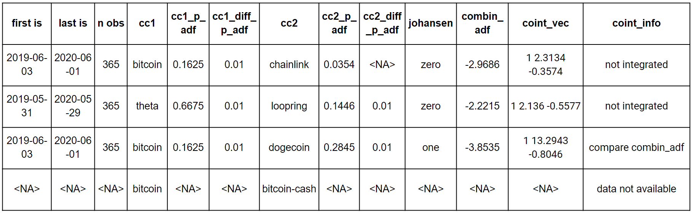
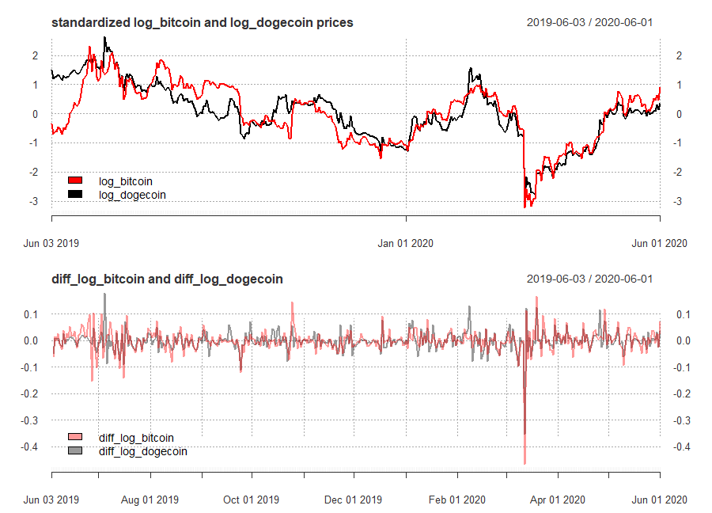
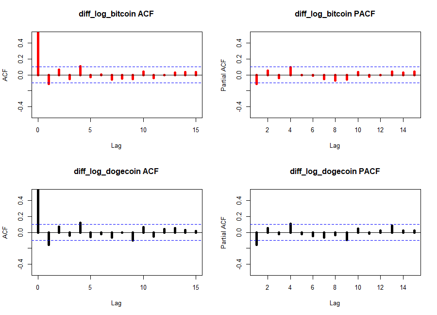

# University Time Series Project
#### Hubert Śmieciuch 2020

------

This project consists of several requirements:

1. Selecting two cointegrated cryptocurrencies.
2. Building Arima models.
3. Making forecasts based on Arima for both currencies.
4. Building VAR/VECM model.
5. Making forecast.
6. Comparing results.  

In this repository apart from libraries available on `CRAN` I use two functions written by my lecturers:

`getCryptoHistoricalPrice` by Paweł Sakowski, Phd 

`testdf` by Phd. Rafał Woźniak, Phd

I have written function that compares each pair of currencies available on www.coinmarketcap.com at selected time span, and performs cointegration test of non-stationary time series to identify pairs of currencies that may be cointegrated, and which are `I(1)`. Exact verification must be done comparing ADF test results from time series function output, with Dickey-Fuller cointegration table selecting appropriate number of observations and regressors of linear combination.

The table below shows the results of cointegration analysis made in loop for **log closing prices**  of each pair of currencies available on the website, based on 365 observations (in sample) prior to mid June 2020. 

Table above shows example output, where a row contains Engle&Granger and Johansen cointegration procedures results, testing for integration of series that are themselves I(1).

Each row of the table contains several information. First column  is the **range of  time of in sample data**, **number of observations** used for each currency in cointegration procedure. Next 3 columns are consecutively **name of the first crypto currency** followed by **adf test p-value** for the first augmentation that do not reveal the problem of autocorrelation of any lag; *if mentioned p-value is higher that 5%* critical value, next column contain **adf test p-values of the first difference series**. Columns 7-9 present the according results for second crypto currency.   Column 10 tells the rank of VECM model obtained from Johansen test (**zero**: no cointegrating vector; **one**: one cointegrating vector). 

Last three columns refer to linear combination of crypto currencies. It's adf statistic, cointegrating vector and information, and final information regarding cointegration.

There are three possibilties:

1. **compare combin_adf** in the last column suggest that we may consider given pair of cryptocurrencies cointegrated, but for final conclusion we need to look up a critical value of ADF test for appropriate number of observations and regressors in combination OLS and compare it with our staistic. If the value is more negative than critical value, we observe cointegrated pair of crypto currencies. 
2. **not integrated** - direct answer, when at least one of the condition of cointegration was not met. Example in the first row shows that this pair is not cointegrated, because the p-value for the first augmentation of time series, that does not deal with autocorrelation is lower than 5% critical value, suggesting that the second currency was I(0) within considered period. If pair was cointegrated according to Engle&Granger but Johansen test did not supported this thesis (showing zero), the final column shows **not cointegrated**. 
3. **data not available** is shown when ``getCryptoHistoricalPrice`` faild to download the data, probably due to the fact that data was available under modified name for one currency, thus generic link was not appropriate. In this can neither of the test was performed, and we do not consider this pair.

Among considered 4950 combinations, _______ appeared not to be cointegrated in given period, ___cases resulted in error in data collection, and ____could be reviewed for further consideration, and drawing conclusion based on ADF statistic of linear combination.

Considering only combinations which ADF statistic lower than -3.8, ____ pairs were obtained, out of which after visual revision of the series plots and their acf/pacf plots, the cardano-siacoin pair was selected.  

For each pair cointegration tests were performed for 365 observations (in sample), and following 15 were saved as out of sample, however finally forecasts were done for 7 days ahead.

### **Bitcoin-Dogecoin** - visual inspection

**Bitcoin-Dogecoin** pair was chosen for modeling and forecasting. Below are presented plots of their standardized log-prices which may serve as visual prove that those crypto currencies indeed seem cointegrated. In general they follow similar patter, and if not, the period they move in different direction is rather short while the difference between their log prices is not outstanding by visual inspection.

Their first differences seem indeed stationary, the variance apart from few moments seem relatively constant, however there are some shocks, when the volatility of log prices rise significantly, these for both currencies those moments are mostly the same, apart from late October 2019 when Bitcoin experienced positive shock, or first part of February of 2020 when Dogecoin experienced positive shock, higher than Bitcoin. It needs to be noted however that there is visible some volatility clustering. Which may be a good reason to apply also VAR/VECM models.

Looking on correlograms of their first differences, It seems that neither follow pure AR or MA process (ACF doesn't drop slowly and PACF doesn't drop abruptly) or pure MA process (ACF doesn't drop abruptly, and PACF doesn't drop slowly). Thus the exact number of sufficient lags cannot be deducted from it. There are no regular spikes and or sinusoidal moves, thus no seasonality or periodicity is anticipated. 

For Bitcoin log-prices lags 1, 4 to show significant correlation with chosen moment, both at ACF and PACF. Dogecoin shows similar pattern with exception than ACF at second lag is relatively close to the dashed line. In next step the error correction model will be evaluated for these crypto currencies.

## ECM

Linear combination of these two series is expressed by following relation:

Linear combination model summary coefficients are significant (both log_bitcoin and intercept). They denote the long-run relationship between these two and shape the cointegrating vector. 

Cointegrating vector is **[1, - 13.294229, -0.80464]**. It can be interpreted as follows, **if bitcoin log prices of increase by 1 percentage point, log prices increase by  ~0.8 percentage point**.

 

Short run relationship is defined by parameters of ECM equation, which if shaped by following equation, where **lresid** basically corresponds to linear combination residuals:

The summary of the ECM model provides parameters that inform about short-run relationship and adjustment coefficient. Intercept is not significant. The diff_log_bitcoin parameter informs that **if bitcoin log price increases by 1 unit, log price of dogecoin increases by ~0.645 units**. The adjustment coefficient (lresid estimated coefficient) is negative which is consistent with expectations. It's value around 5% means that **an unexpected error should be offset within 20 days**, which is relatively long time.

### Granger casuality

For selected pair of crypto currencies granger casuality analysis was performed to detect if, and which lag changes Bitcoin log-prices may granger cause changes of Degecoin and vice versa. The results are presented below. The null hypothesis stays that there is no Granger casuality.  The underlying Wald test p-values are present in columns 2 and 4. As the grangertest documentation says, they come from comparison of the unrestricted model—in which y is explained by the lags (up to given order order) of y and x — and the restricted model—in which y is only explained by the lags of y. Columns 3, 5 tell if at given lag the granger casuality was observed.   

The outcome shows that it is log-bitcoin that may have an granger casual effect on Dogecoin log-prices, at lags 1-4. Neither of 1-7 lags of Dogecoin exhibits granger cause effect on Bitcoin, which make sense, as Bitcoin has immensely bigger capitalization and prices; is simply much stronger crypto-currency.

### ARIMA - Bitcoin

Four different ARIMA models were evaluated for Bitcoin. 

1. ARIMA(4,14) - inspired by correlograms.
2. ARIMA(7,1,7) - to check each day of the week.
3. ARIMA(1,1,1) - chosen by auto.arima function with max p and q = 7 and seasonality also being in scope; choice based on AIC criterion.
4. ARIMA(0,1,1)  - chosen by auto.arima function with max p and q = 7 and seasonality also being in scope; choice based on BIC criterion.

All compuattions may be mimicked running the repository codes of **3_arima.R** script. ACF and PACF plots of residuals was not a major problem for any of the models except the BIC criterion based auto-arima.

 The same results showed Ljung-Box test. Each model residuals were not autocorrelated up to  4, 7, 14, 21 and 28 days consecutively (in all cases H0 of independence in a given time series was failed to be rejected), however p-values for the last model were the lowest.

AIC and BIC criterions suggested different models, however in both cases auto ARIMA selected models occurred to be better. Due to potential autocorrelation issues model indicated by AIC criterion was selected for forecasting of log Bitcoin prices using ARIMA model.

Both (AR and MA) coefficients were significant.

### ARIMA - Dogecoin

Three different ARIMA models were evaluated for Bitcoin. 

1. ARIMA(4,14) - inspired by correlograms.

2. ARIMA(7,1,7) - to check each day of the week.

3. ARIMA(1,1,0)- chosen by both AIC and BIC auto.arima function criterions as an optimal one, while max p and q = 7 and seasonality also being in scope.

   

Similarly to the Bitcoin ARIMA  ACF and PACF plots of model residuals showed that automatically selected model might have an issue of autocorrelation at 4th lag, however Ljung-Box test let reject this assumption, upholding the hull hypothesis about lack of autocorrelation in residuals it in all cases (lags up to 4,7,14,21 and 28 days).

AIC and BIC criterions suggested different models. AIC as expected suggested less parsimonious model with ARIMA(7,1,7), while BIC suggested ARIMA(1,1,0), which is basically AR model on differenced data, which may seem surprising, as correlogram of first differences  of log prices of Dogecoin did not seem to match pure AR process ACF and PACF patterns.

However due to the fact that this model is much simpler and the difference in BIC criterions in higher between models than differences between AIC criterions,  forecast was done using ARIMA(1,1,0).

AR coefficient was significant, however p-value was not equal 0. 

### VAR 

Function VAR select suggested two lags in vector autoregressive model. Three different models were checked.

1. VAR(2) without seasonal terms.

2. VAR(2) with seasonal terms.

3. Restricted VAR model with restriction based on Granger casuality and parameters significance of first VAR(2) model outcomes.

4. VAR(4), which was computed as the last one, to verify, if adding 4th lag will diminish correlation of 4th lag visible on ACF and PACF plots.

   

VAR models residual plots for both currencies are presented below. What is visible, is that lag 4 in each is slightly above the line. The situation did not change even in VAR model with 4 lags, the effect of adding 2 additional lags was reducing correlation of lower lags (1, 2 and 3), which is visible on 4th row of plots - dark green bars.

Breusch-Godfrey test results however prove no problem of autocorrelation in residuals, except restricted VAR model, with lags up to 14 days, where the null hypothesis of no autocorrelation has been rejected at significance level of 5%.  Other models, values of BG test p-values at this level of lags were slightly above critical value. It needs to be noted however that VARselect function was run with lag.max argument set to 14, which means, that in spite of the fact that the algorithm could have chosen even that far lag, such model did not have the most favorable information criteria value.

AIC and BIC criterions again suggested different models. AIC suggest however in both cases auto ARIMA selected models occurred to be better. Due to potential autocorrelation issues model indicated by AIC criterion was selected for forecasting of log Bitcoin prices using ARIMA model.

### VECM 

### Forecasts

