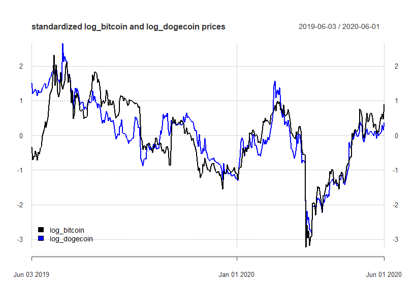
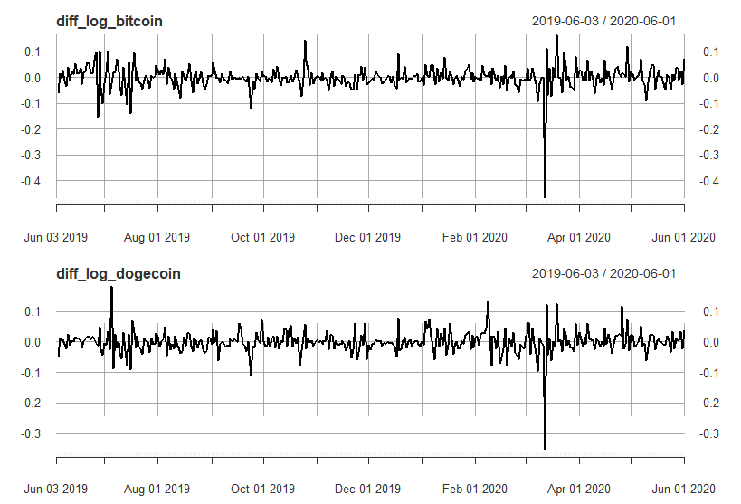
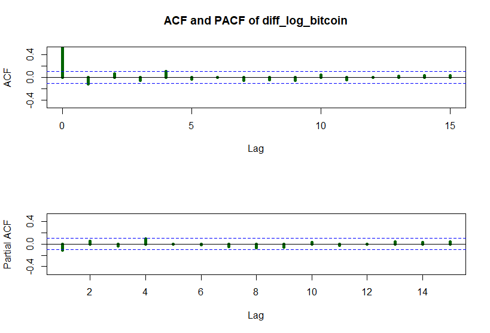
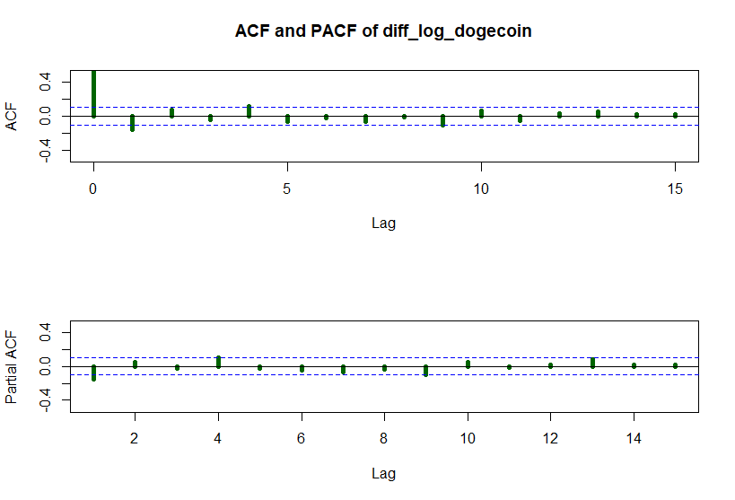

# University Time Series Project
Hubert Śmieciuch 2020

------

This project consists of several requirements:

1. Selecting two cointegrated cryptocurrencies.
2. Building Arima models.
3. Making forecasts based on Arima for both currencies.
4. Building VAR/VECM model.
5. Making forecast.
6. Comparing results.  

In this repository apart from libraries available on `CRAN` I use two functions written by my lecturers:

`getCryptoHistoricalPrice` by Paweł Sakowski, Phd 

`testdf` by Phd. Rafał Woźniak, Phd

I have written function that compares each pair of currencies available on www.coinmarketcap.com at selected time span, and performs cointegration test of non-stationary time series to identify pairs of currencies that may be cointegrated, and which are `I(1)`. Exact verification must be done comparing ADF test results from time series function output, with Dickey-Fuller cointegration table selecting appropriate number of observations and regressors of linear combination.

The table below shows the results of cointegration analysis made in loop for **log closing prices**  of each pair of currencies available on the website, based on 365 observations (in sample) prior to mid June 2020. 

Table above shows example output, where a row contains Engle&Granger and Johansen cointegration procedures results, testing for integration of series that are themselves I(1).

Each row of the table contains several information. First column  is the **range of  time of in sample data**, **number of observations** used for each currency in cointegration procedure. Next 3 columns are consecutively **name of the first crypto currency** followed by **adf test p-value** for the first augmentation that do not reveal the problem of autocorrelation of any lag; *if mentioned p-value is higher that 5%* critical value, next column contain **adf test p-values of the first difference series**. Columns 7-9 present the according results for second crypto currency.   Column 10 tells the rank of VECM model obtained from Johansen test (**zero**: no cointegrating vector; **one**: one cointegrating vector). 

Last three columns refer to linear combination of crypto currencies. It's adf statistic, cointegrating vector and information, and final information regarding cointegration.

There are three possibilties:

1. **compare combin_adf** in the last column suggest that we may consider given pair of cryptocurrencies cointegrated, but for final conclusion we need to look up a critical value of ADF test for appropriate number of observations and regressors in combination OLS and compare it with our staistic. If the value is more negative than critical value, we observe cointegrated pair of crypto currencies. 
2. **not integrated** - direct answer, when at least one of the condition of cointegration was not met. Example in the first row shows that this pair is not cointegrated, because the p-value for the first augmentation of time series, that does not deal with autocorrelation is lower than 5% critical value, suggesting that the second currency was I(0) within considered period. If pair was cointegrated according to Engle&Granger but Johansen test did not supported this thesis (showing zero), the final column shows **not cointegrated**. 
3. **data not available** is shown when ``getCryptoHistoricalPrice`` faild to download the data, probably due to the fact that data was available under modified name for one currency, thus generic link was not appropriate. In this can neither of the test was performed, and we do not consider this pair.

Among considered 4950 combinations, _______ appeared not to be cointegrated in given period, ___cases resulted in error in data collection, and ____could be reviewed for further consideration, and drawing conclusion based on ADF statistic of linear combination.

Considering only combinations which ADF statistic lower than -3.8, ____ pairs were obtained, out of which after visual revision of the series plots and their acf/pacf plots, the cardano-siacoin pair was selected.  

For each pair cointegration tests were performed for 365 observations (in sample), and following 15 were saved as out of sample, however finally forecasts were done for 7 days ahead.

The pair that was chosen for modeling and forecasting was **bitcoin-dogecoin**. 

## ECM

Error Correction model was computed

 

 

